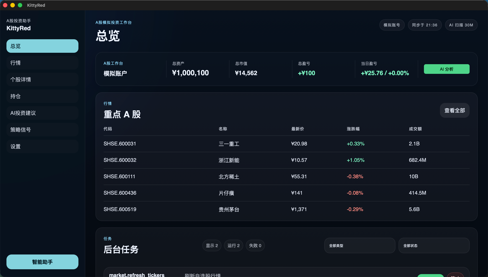

# KittyRed



**本地 A 股模拟投资研究工作台。**

KittyRed 是一个本地优先的桌面应用，帮助个人投资者在 A 股市场中进行行情监控、AI 智能推荐、模拟交易和助手驱动的研究。它不连接真实券商账户，所有交易能力均明确标注为模拟，专注于提供一个冷静、专业、数据密集的研究环境。

前端基于 React、Vite 和 TypeScript 构建，后端基于 Rust 和 Tauri，数据通过 AKShare 获取，本地 SQLite 持久化。

---

## 快速开始

### 环境要求

- [Node.js](https://nodejs.org/) >= 18
- [Rust](https://www.rust-lang.org/tools/install) (stable)
- [Tauri 系统依赖](https://v2.tauri.app/start/prerequisites/)
- [Python 3](https://www.python.org/) (用于 AKShare 数据适配层)

### 安装

```bash
git clone https://github.com/kittlabs/KittyRed.git
cd KittyRed
npm install
```

### 启动开发环境

```bash
npm run tauri -- dev
```

### 运行测试

```bash
# 前端测试
npm test

# Rust 后端测试
cd src-tauri && cargo test
```

### 构建生产版本

```bash
npm run build
cd src-tauri && cargo build --release
```

---

## 功能介绍

### 行情与市场

- **自选股行情**：实时监控沪深 A 股行情，数据来源为 AKShare 雪球接口，每 60 秒自动刷新
- **个股详情**：K 线图表（5 分钟 / 1 小时 / 日线 / 周线）、盘口数据、个股基本面信息
- **股票池搜索**：本地缓存的 A 股股票池，支持代码和名称模糊搜索

### AI 智能推荐

- **手动推荐**：点击生成 AI 建议，基于自选股行情、K 线、持仓和风控设置，逐股票生成买入、卖出或观望结论
- **自动推荐**：可配置定时自动扫描（5 分钟 / 10 分钟 / 30 分钟 / 1 小时），支持每日调用上限、连续亏损暂停等安全机制
- **风控评估**：每条 AI 建议经过独立风控引擎评估，检查置信度、止损空间、风险收益比等维度，自动拦截不合规的建议
- **历史评估**：推荐结果在 5 分钟 / 10 分钟 / 30 分钟 / 60 分钟 / 24 小时 / 7 天窗口自动评估收益
- **审计追踪**：完整记录 AI 原始输出、结构化解析、风控结果、行情快照，支持逐条审查

### 模拟交易

- **虚拟账户**：支持 `paper`（纯模拟）、`real_read_only`（只读真实账户）、`dual`（双模式）三种账户模式
- **自动执行**：开启后 AI 推荐通过风控的买入建议会自动生成模拟委托
- **持仓管理**：实时跟踪持仓盈亏，支持止盈止损自动平仓
- **订单监控**：后台自动监控持仓状态，触达止盈或止损价位时自动平仓并发送通知

### 信号扫描

- **策略配置**：可配置扫描策略的评分规则、频率、最低分数、冷却时间等参数
- **信号生成**：基于技术指标和量价结构生成交易信号
- **扫描历史**：记录每次扫描的运行状态和结果

### AI 助手

- **对话式研究**：侧边抽屉式 AI 助手，支持自然语言提问
- **上下文感知**：助手自动获取当前市场数据、持仓状态和推荐结果作为上下文
- **工具调用**：助手支持查询行情、查看持仓、获取推荐等工具能力

### 设置中心

- **模型配置**：支持 OpenAI 兼容和 Anthropic 兼容的 LLM 提供商，可配置 API Key、模型名称、温度、最大 Token 等
- **风控参数**：最低置信度、最大单笔亏损、最大每日亏损、最低风险收益比、最低成交量、最大价差等
- **黑白名单**：可指定优先关注或禁止推荐的股票
- **通知管理**：可独立控制推荐、价差、模拟订单三类桌面通知的开关

---

## 项目结构

```
KittyRed/
├── src/                    # 前端源码
│   ├── features/           # 页面模块（dashboard, markets, recommendations, signals, settings 等）
│   ├── components/         # 共享组件（layout, assistant, jobs）
│   ├── store/              # Zustand 状态管理
│   └── lib/                # 工具函数、Tauri 桥接、类型定义
├── src-tauri/              # Rust 后端
│   └── src/
│       ├── commands/       # Tauri 命令入口
│       ├── market/         # 行情服务、AKShare 适配、缓存
│       ├── recommendations/# AI 推荐引擎、风控、LLM 调用
│       ├── paper/          # 模拟交易、持仓、订单
│       ├── signals/        # 信号扫描、策略引擎
│       ├── assistant/      # AI 助手、工具调用
│       ├── settings/       # 设置服务、密钥管理
│       └── db/             # SQLite 数据库
├── backend/                # Python AKShare 适配层
├── docs/                   # 设计文档
└── assets/                 # 静态资源
```

---

## 技术栈

| 层级 | 技术 |
|------|------|
| 前端框架 | React 19 + TypeScript + Vite |
| 状态管理 | Zustand + TanStack Query |
| 桌面壳 | Tauri 2 (Rust) |
| 数据库 | SQLite (rusqlite) |
| 行情数据 | AKShare (Python) |
| LLM 集成 | OpenAI 兼容 / Anthropic 兼容 |

---

## 设计规范

KittyRed 遵循"安静的交易桌面"设计语言：深色背景、克制的青色强调、紧凑的数据排版。所有用户可见文案使用中文，所有交易表面明确标注为模拟。详见 [DESIGN.md](./DESIGN.md)。

---

## License

Private. All rights reserved.
