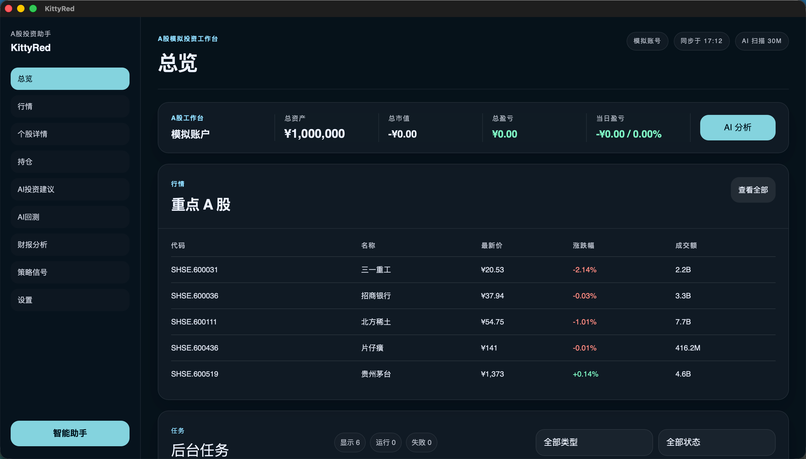
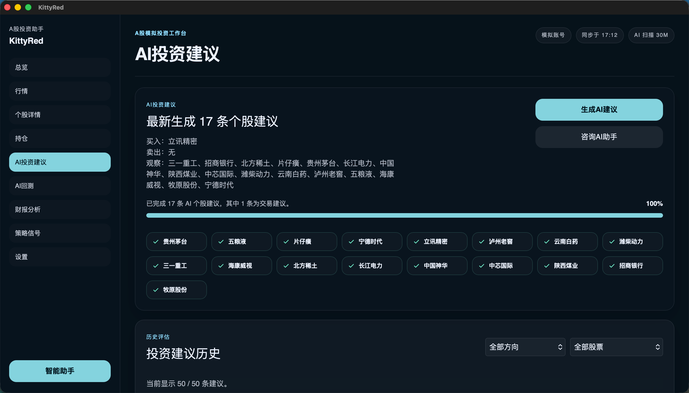
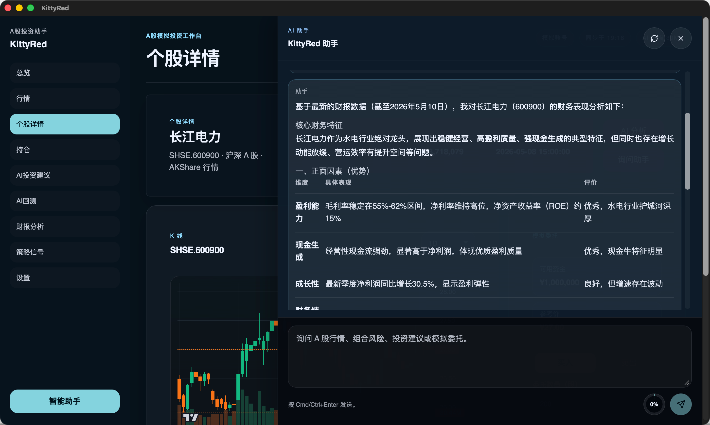
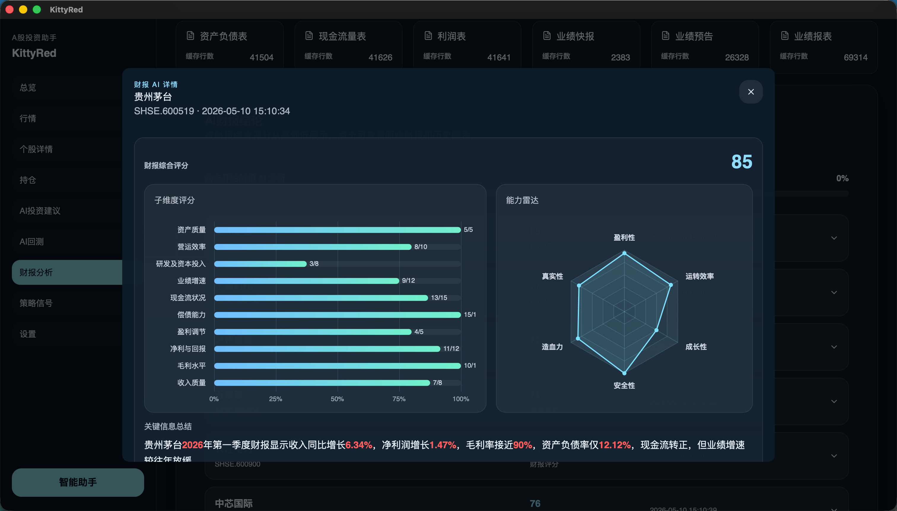
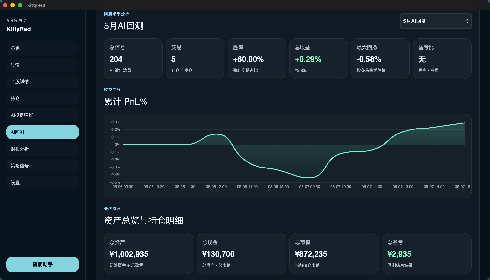

# KittyRed



**本地 A 股模拟投资研究工作台。**

KittyRed 是一个本地优先的桌面应用，帮助个人投资者在 A 股市场中进行行情监控、AI 智能推荐、模拟交易和助手驱动的研究。它不连接真实券商账户，所有交易能力均明确标注为模拟，专注于提供一个冷静、专业、数据密集的研究环境。

前端基于 React、Vite 和 TypeScript 构建，后端基于 Rust 和 Tauri，数据通过 AKShare 获取，本地 SQLite 持久化。

---

## 快速开始

### 环境要求

- [Node.js](https://nodejs.org/) >= 18
- [Rust](https://www.rust-lang.org/tools/install) (stable)
- [Tauri 系统依赖](https://v2.tauri.app/start/prerequisites/)
- [Python 3](https://www.python.org/) (用于 AKShare 数据适配层)

### 安装

```bash
git clone https://github.com/kittlabs/KittyRed.git
cd KittyRed
npm install
```

### 启动开发环境

```bash
npm run tauri -- dev
```

### 运行测试

```bash
# 前端测试
npm test

# Rust 后端测试
cd src-tauri && cargo test
```

### 构建生产版本

```bash
npm run build
cd src-tauri && cargo build --release
```

---

## 功能介绍

### 1. A 股工作台与行情总览

- **总览首页**：集中展示模拟账户资产、自选股摘要和后台任务状态，适合先看账户、再看行情、再发起 AI 分析
- **自选股行情**：行情来自 AKShare，自选股列表优先读取本地 SQLite 缓存，再在后台刷新；自选股行情刷新间隔为 60 秒
- **股票池搜索**：A 股股票池会预热到本地缓存，支持按代码和名称模糊搜索，避免每次输入都实时拉全量列表
- **个股详情**：进入个股页后可查看 K 线、价格区间和个股研究入口，页面会在缓存可用时先展示本地数据


### 2. AI 投资建议

- **一键生成建议**：围绕自选股票池逐股生成买入、卖出或观望建议，而不是只分析单一股票
- **风控先行**：每条建议都带有风控状态、交易区间、止损价和理由，不合规建议会被拦截
- **进度与审计**：生成过程可见逐股进度，历史记录保留方向、执行状态、审计详情和提示词快照
- **结果复盘**：推荐历史会持续补充 10 分钟、60 分钟、24 小时和 7 天评估结果，方便回看建议质量



### 3. AI 助手与个股研究

- **抽屉式助手**：右侧助手可在不离开当前页面的情况下继续追问行情、组合风险、建议理由或模拟委托
- **带上下文提问**：助手会结合当前个股、持仓、推荐和财报缓存来回答，不需要手工重复喂上下文
- **研究链路连通**：从个股详情、AI 建议和财报分析都可以继续进入助手对话，形成连续研究流程



### 4. 财报缓存与 AI 财报分析

- **全量财报缓存**：支持拉取沪深 A 股近两年全量财报到本地缓存，覆盖资产负债表、现金流量表、利润表、业绩快报、业绩预告和业绩报表
- **自选股财报结论**：在全量缓存基础上，只对自选股票池生成 AI 财报结论，避免空耗模型调用
- **原始数据可追溯**：评分明细、原始财报分段、关键指标序列和历史图表都可继续下钻查看



### 5. AI 回测

- **数据准备到结果分析一体化**：先拉取历史快照，再批量生成 AI 信号，最后顺序回放模拟交易
- **并发信号生成**：回测中的 AI 信号生成支持多路并发评估，适合快速比较不同股票和时间段
- **结果面板完整**：可查看收益曲线、总收益、回撤、最终持仓、交易明细和每次信号表现



### 6. 模拟交易、策略信号与设置

- **纯模拟账户**：当前版本仅启用 `paper` 模拟账号，支持持仓查看、逐仓清仓、委托记录和一键重置账户
- **策略信号**：内置信号扫描页，可配置策略参数、执行扫描并查看最新信号与历史记录
- **设置中心**：可配置 AKShare 连通性检查、模型服务、AI 交易参数和完整系统提示词

---

## 项目结构

```
KittyRed/
├── src/                    # 前端源码
│   ├── features/           # 页面模块（dashboard, markets, recommendations, signals, settings 等）
│   ├── components/         # 共享组件（layout, assistant, jobs）
│   ├── store/              # Zustand 状态管理
│   └── lib/                # 工具函数、Tauri 桥接、类型定义
├── src-tauri/              # Rust 后端
│   └── src/
│       ├── commands/       # Tauri 命令入口
│       ├── market/         # 行情服务、AKShare 适配、缓存
│       ├── recommendations/# AI 推荐引擎、风控、LLM 调用
│       ├── paper/          # 模拟交易、持仓、订单
│       ├── signals/        # 信号扫描、策略引擎
│       ├── assistant/      # AI 助手、工具调用
│       ├── settings/       # 设置服务、密钥管理
│       └── db/             # SQLite 数据库
├── backend/                # Python AKShare 适配层
├── docs/                   # 设计文档
└── assets/                 # 静态资源
```

---

## 技术栈

| 层级 | 技术 |
|------|------|
| 前端框架 | React 19 + TypeScript + Vite |
| 状态管理 | Zustand + TanStack Query |
| 桌面壳 | Tauri 2 (Rust) |
| 数据库 | SQLite (rusqlite) |
| 行情数据 | AKShare (Python) |
| LLM 集成 | OpenAI 兼容 / Anthropic 兼容 |

---

## 设计规范

KittyRed 遵循"安静的交易桌面"设计语言：深色背景、克制的青色强调、紧凑的数据排版。所有用户可见文案使用中文，所有交易表面明确标注为模拟。详见 [DESIGN.md](./DESIGN.md)。

---

## License

Private. All rights reserved.
